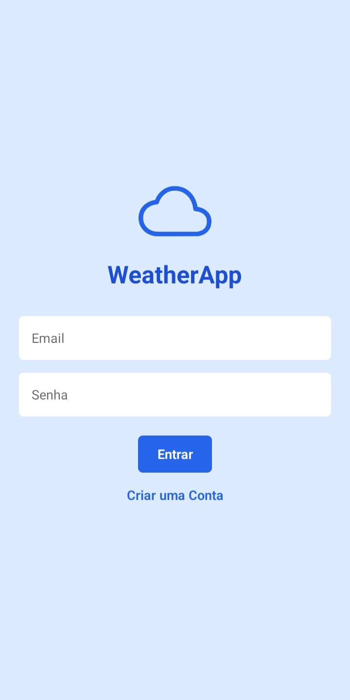
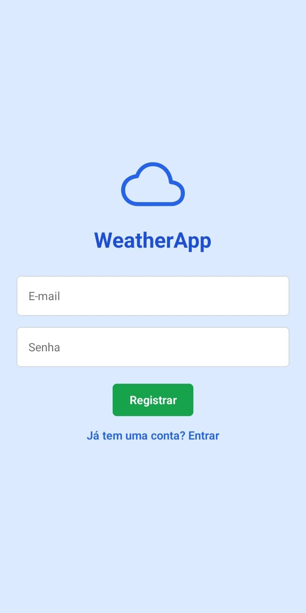
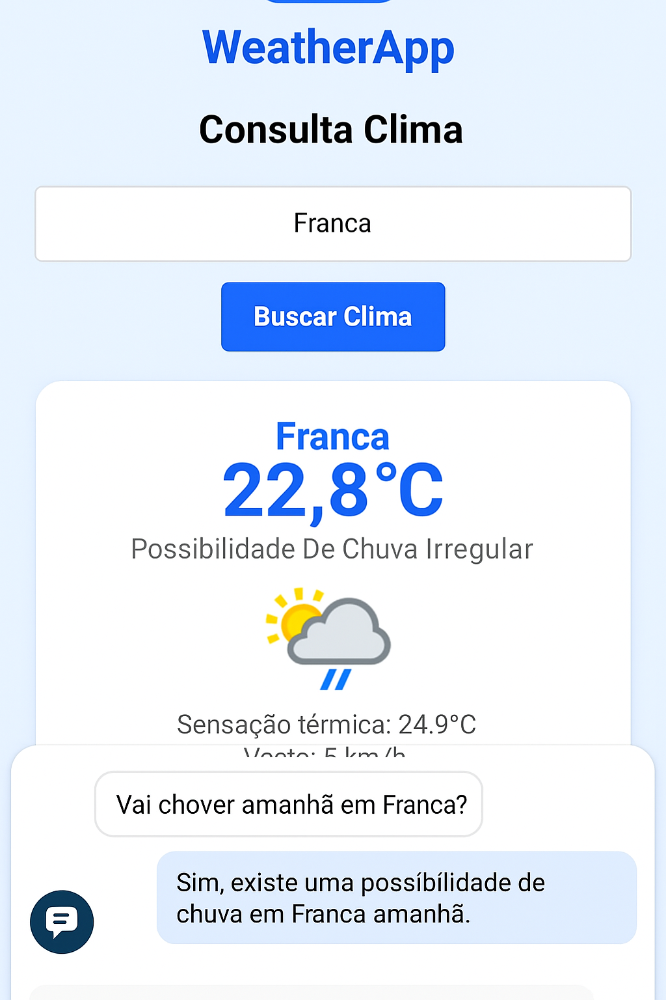

# 🌦️ WeatherApp

Aplicativo de consulta de clima em tempo real usando **React Native**, **Expo**, **Firebase Authentication** e integração com a **WeatherAPI**.

---

## 📋 Sumário

- [Sobre o Projeto](#sobre-o-projeto)
- [Tecnologias Utilizadas](#tecnologias-utilizadas)
- [Configuração e Instalação](#configuração-e-instalação)
- [Imagens do App](#imagens-do-app)
- [Download do APK / Teste Web](#download-do-apk--teste-web)

---

## 📖 Sobre o Projeto

O **WeatherApp** é um aplicativo mobile que permite:
- Consultar o clima atual de qualquer cidade.
- Fazer login e cadastro de usuários (via Firebase Authentication).
- Interface bonita, moderna e responsiva usando **NativeWind** (Tailwind para React Native).
- Sistema seguro de autenticação de usuários.
- Exibição de informações como temperatura, sensação térmica, umidade e velocidade do vento.

---

## 🚀 Tecnologias Utilizadas

- [Expo](https://expo.dev/)
- [React Native](https://reactnative.dev/)
- [NativeWind](https://www.nativewind.dev/) (Tailwind para RN)
- [Firebase Authentication](https://firebase.google.com/)
- [WeatherAPI](https://www.weatherapi.com/) (Free tier)
- [@expo/vector-icons](https://icons.expo.fyi/)

---

## 🛠️ Configuração e Instalação

### 1. Clone o repositório:

```bash
git clone https://github.com/LucasHapr/WeatherApp
cd weatherapp
```

### 2. Instale as dependências:

```bash
npm install
```

### 3. Configure suas chaves no .env
```bash
FIREBASE_API_KEY=SUA_CHAVE_FIREBASE
FIREBASE_AUTH_DOMAIN=SEU_DOMINIO_FIREBASE
FIREBASE_PROJECT_ID=SEU_PROJECT_ID
FIREBASE_STORAGE_BUCKET=SEU_BUCKET_FIREBASE
FIREBASE_MESSAGING_SENDER_ID=SEU_SENDER_ID
FIREBASE_APP_ID=SEU_APP_ID

WEATHER_API_KEY=SUA_CHAVE_WEATHER_API
```

### 4. Inicie o projeto:
```bash
npx expo start
```

## 🖼️ Imagens do App

### Tela de Login


### Tela de Cadastro


### Tela de Consulta Clima (com nova funcionalidade!)



## 📥 Download do APK / Teste Web
- 🔥 [Baixar APK](https://expo.dev/artifacts/eas/hHs6L22mz4PtwZ5737GwX6.aab)
